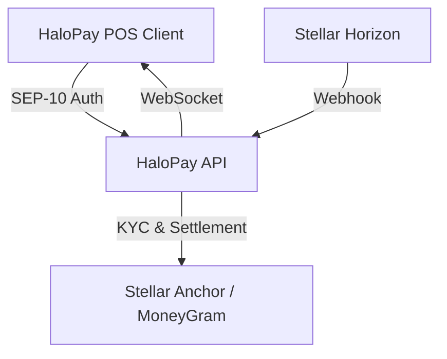

<!-- Optional: replace with a banner image. Keep it plain — a wordmark, not a stock illustration. -->
<h1 align="center">HaloPay API</h1>

<p align="center">
  The dedicated settlement backend for HaloPay — a self-custodied Point-of-Sale and merchant settlement protocol built for crisis zones and offline environments where traditional digital banking infrastructure does not exist.
</p>

<p align="center">
  <a href="https://github.com/HaloPaye/halopay-api/actions"></a>
  <a href="LICENSE"></a>
  
  
</p>

---

## Core Architecture

1. **SEP-10 Web Authentication**: Standardized Stellar challenge-response flow issuing JWTs for secure merchant interactions.
2. **SEP-12 KYC Ingestion**: Ingests merchant verification fields and binary government ID photos (`multipart/form-data`) to transmit to Stellar anchors (e.g. MoneyGram).
3. **SEP-24 Fiat Off-Ramp Orchestration**: Programmatically converts aggregated USDC daily sales into local fiat via anchor off-ramp quotes and withdrawals.
4. **On-Chain Webhook & WebSocket Broadcaster**: Listens to Stellar Horizon payment streams for incoming USDC aid payments and broadcasts instant payment confirmations to merchant POS devices over WebSockets.

### Architecture Diagram



### How the Settlement Engine Works

The HaloPay backend is entirely focused on providing a seamless bridge between a merchant who may have intermittent connectivity and the robust Stellar on-chain ecosystem. 

1. **Authentication (SEP-10):** Merchants sign an authentication challenge using their private Stellar key. The API verifies this signature and issues a JWT. This ensures that the backend only orchestrates fiat withdrawals for verifiable wallet owners.
2. **KYC Uploads (SEP-12):** To comply with local regulations and anchor requirements, merchants must upload their government ID. Since these files are often large binary images, the API implements a secure `multipart/form-data` ingestion route that validates file sizes and MIME types before forwarding the payload directly to a secure storage bucket and the Anchor.
3. **Fiat Off-Ramp (SEP-24):** When a merchant chooses to settle their USDC balance to local fiat (e.g., to their bank account or mobile money wallet), the API initiates the SEP-24 interactive withdrawal flow with an anchor like MoneyGram, abstracting away the complex Stellar network fees and reserve requirements.
4. **Resilient WebSocket Delivery:** Since POS terminals can drop connection at any time, the API maintains a constant listener on the Stellar Horizon network. When it detects a payment to a registered merchant, it broadcasts it. If the merchant reconnects later, the system will instantly push any missed payments so the UI always reflects the true ledger state.

---

## Stellar & Soroban Architecture Integration

HaloPay API implements the gold standard for Stellar Ecosystem Proposals (SEPs) and Soroban RPC settlement:

* **SEP-10 (Web Authentication):** Cryptographically binds merchant sessions using challenge-transaction signatures verified against Stellar Horizon.
* **SEP-12 (KYC Client API):** Manages merchant customer identity data collection and secure forwarding to licensed Stellar anchors.
* **SEP-24 (Hosted Deposit & Withdrawal):** Orchestrates interactive fiat off-ramping flows with global anchors (e.g., MoneyGram), turning digital USDC revenue into local physical cash.
* **SEP-38 (Anchor RFQ Quotes):** Provides programmatic access to real-time indicative and firm price quotes between stellar assets and fiat currencies.
* **Soroban RPC & Horizon Stream Listeners:** Real-time event streaming of payment ledger entries, broadcasting instant cryptographic confirmation to offline POS terminals the moment internet connectivity is restored.

---

## Tech Stack

- **Language**: TypeScript (Node.js 20+)
- **Framework**: Express.js
- **Blockchain Core**: `@stellar/stellar-sdk`
- **File Ingestion**: `multer` (handling multipart binary government ID images)
- **Real-Time Communication**: `ws` (WebSockets)
- **Validation & Auth**: Zod, JSON Web Tokens

---

## Setup & Quick Start

```bash
# Clone the repository
git clone https://github.com/HaloPaye/halopay-api.git
cd halopay-api

# Install dependencies
npm install

# Run dev environment
npm run dev

# Run unit tests
npm test
```

## Maintainers & Contact

| Maintainer | Contact / Telegram | Role |
| :--- | :--- | :--- |
| HaloPay Team | [@HaloPayDev](https://t.me/HaloPayDev) | Core Protocol Engineering |
| Lead Engineer | security@halopay.io | Security & Operations |

## Contributors

[](https://github.com/HaloPaye/halopay-api/graphs/contributors)

---

## License

This project is licensed under the MIT License - see the [LICENSE](LICENSE) file for details.
