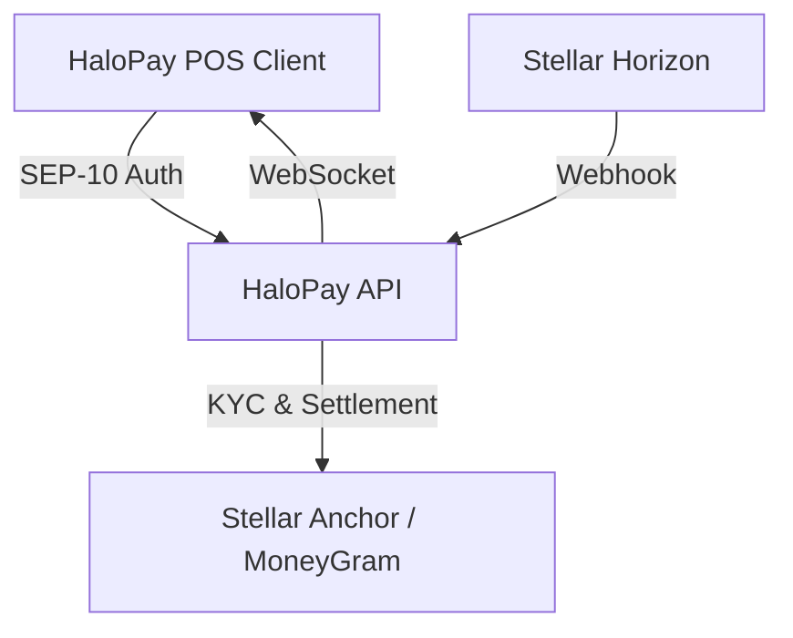

# HaloPay API (The Settlement Backend)

[](https://github.com/HaloPaye/halopay-api)
[](https://opensource.org/licenses/MIT)

**HaloPay API** is the dedicated settlement backend for HaloPay — a self-custodied Point-of-Sale and merchant settlement protocol built for crisis zones and offline environments where traditional digital banking infrastructure does not exist.

---

## Core Architecture

1. **SEP-10 Web Authentication**: Standardized Stellar challenge-response flow issuing JWTs for secure merchant interactions.
2. **SEP-12 KYC Ingestion**: Ingests merchant verification fields and binary government ID photos (`multipart/form-data`) to transmit to Stellar anchors (e.g. MoneyGram).
3. **SEP-24 Fiat Off-Ramp Orchestration**: Programmatically converts aggregated USDC daily sales into local fiat via anchor off-ramp quotes and withdrawals.
4. **On-Chain Webhook & WebSocket Broadcaster**: Listens to Stellar Horizon payment streams for incoming USDC aid payments and broadcasts instant payment confirmations to merchant POS devices over WebSockets.

### Architecture Diagram



---

## Tech Stack

- **Language**: TypeScript (Node.js 20+)
- **Framework**: Express.js
- **Blockchain Core**: `@stellar/stellar-sdk`
- **File Ingestion**: `multer` (handling multipart binary government ID images)
- **Real-Time Communication**: `ws` (WebSockets)
- **Validation & Auth**: Zod, JSON Web Tokens

---

## Setup & Quick Start

```bash
# Clone the repository
git clone https://github.com/HaloPaye/halopay-api.git
cd halopay-api

# Install dependencies
npm install

# Run dev environment
npm run dev

# Run unit tests
npm test
```

## Environment Variables

| Variable | Description | Default |
| :--- | :--- | :--- |
| `ANCHOR_URL` | Anchor URL for SEP-24 | `https://anchor.moneygram.com` |
| `ANCHOR_DOMAIN` | Domain for SEP-10 | `anchor.moneygram.com` |
| `JWT_SECRET` | Secret key for JWT | `halopay-default-secret-key-change-in-prod` |

---

## Maintainers & Contact

| Maintainer | Contact / Telegram | Role |
| :--- | :--- | :--- |
| HaloPay Team | [@HaloPayDev](https://t.me/HaloPayDev) | Core Protocol Engineering |
| Lead Engineer | security@halopay.io | Security & Operations |

## Contributors

[](https://github.com/HaloPaye/halopay-api/graphs/contributors)

---

## License

This project is licensed under the MIT License - see the [LICENSE](LICENSE) file for details.
