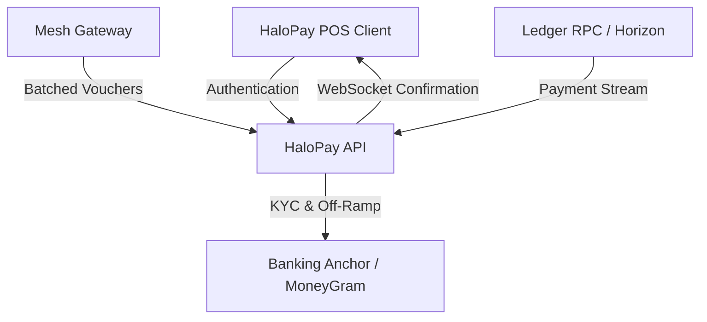

# HaloPay API

The dedicated transaction settlement engine and anchor integration gateway for the HaloPay offline-first payment protocol.

[](https://github.com/HaloPaye/halopay-api/actions)
[](LICENSE)
[](https://nodejs.org)
[](https://www.typescriptlang.org)

---

## Overview

HaloPay API serves as the high-throughput settlement backend connecting offline point-of-sale terminals, decentralized mesh relays, and on-chain liquidity rails. It bridges transactions conducted in network-constrained environments to digital asset settlement and local fiat off-ramping.

The backend orchestrates non-custodial merchant authentication, KYC identity ingestion for regulated off-ramps, automated quote locking, and resilient WebSocket event broadcasting for incoming payments.

---

## System Architecture



### Core Responsibilities

1. **Cryptographic Session Authentication:** Verifies client challenge signatures to issue short-lived JWTs, ensuring the backend only processes actions authorized by valid account keys.
2. **KYC Document Ingestion:** Handles secure `multipart/form-data` uploads for merchant identification files, validating MIME types and sizes before passing payloads to compliance partners.
3. **Fiat Off-Ramp Orchestration:** Coordinates automated conversions from digital settlement balances (e.g. USDC) into local fiat currency bank transfers and mobile money payouts.
4. **Resilient Event Streaming:** Maintains active event listeners on the settlement ledger, pushing real-time confirmation receipts to merchant terminals via WebSockets the instant connectivity is active.
5. **Auditing & Telemetry:** Records tamper-evident cryptographic audit logs with SHA-256 hash chaining and exports Prometheus metrics for latency and throughput monitoring.

---

## Technology Stack

- **Runtime**: Node.js 20+ (TypeScript)
- **Web Framework**: Express.js
- **Settlement SDK**: `@stellar/stellar-sdk`
- **Real-Time Layer**: `ws` (WebSockets)
- **Data & Telemetry**: Winston, Prometheus, Zod
- **Testing**: Jest, Supertest

---

## Quick Start

### Prerequisites
- Node.js v20 or higher
- npm v9 or higher

### Installation & Local Run

```bash
# Clone the repository
git clone https://github.com/HaloPaye/halopay-api.git
cd halopay-api

# Install dependencies
npm install

# Configure environment variables
cp .env.example .env

# Run development server with live reload
npm run dev

# Run comprehensive test suite
npm test

# Build for production
npm run build
```

---

## API Overview

| Method | Endpoint | Description |
| :--- | :--- | :--- |
| `GET` | `/health` | Service liveness and dependency status |
| `GET` | `/api/v1/auth/challenge` | Generate authentication challenge transaction |
| `POST` | `/api/v1/auth/token` | Exchange signed challenge for session JWT |
| `POST` | `/api/v1/kyc/customer` | Ingest merchant verification data and documents |
| `POST` | `/api/v1/offramp/initiate` | Initiate interactive fiat withdrawal flow |
| `GET` | `/api/v1/quotes` | Retrieve indicative and firm exchange rate quotes |
| `WS` | `/events` | Real-time payment confirmation stream |

---

## License

This project is licensed under the MIT License - see the [LICENSE](LICENSE) file for details.
